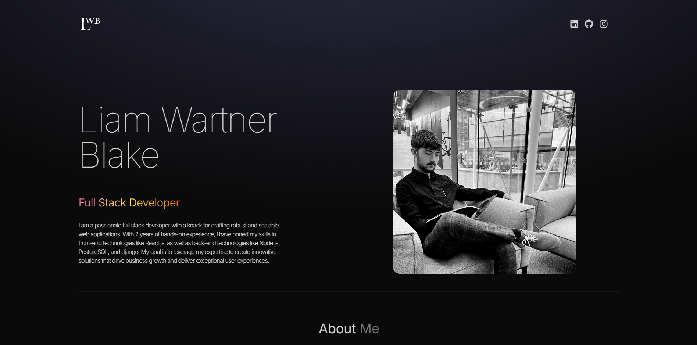

# LWB Portfolio
---
This is a portfolio website made by me, Liam Blake using react, Vite and Tailwind CSS!

This website was built to showcase my technical and web design skills, as well as to sum up my experience and contact information all in a user-friendly 1-page-scroll format.

## Project timeline and technologies used
---
Built in < 24 hours to showcase the following:
- My technical skillset
- My web design skill set
- My projects
- A little bit about me, and where to find me :)

### Technologies used

- HTML5
- CSS3
- JavaScript (ES6)
- Git
- GitHub
- React
- Vite
- Tailwind CSS

## Homepage visuals
---

## Lighthouse tests
---

